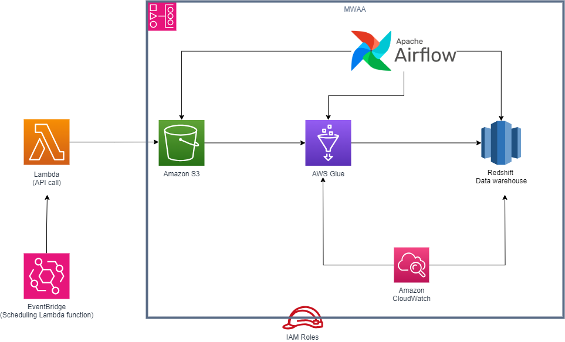

# Setup and Run Guide

## Environment Configuration

Create a `.env` file in the root directory and include these details:

```env
endpoint_url=enter url
aws_access_key_id=enter id
aws_secret_access_key=enter password
db_uri=enter uri
```

## Testing the Pipeline

To test the pipeline, run:

```bash
uv run pytest
```

## Running the ETL Pipeline

To run the ETL pipeline, use the following command:

```bash
uv run --env-file=.env main.py
```

## Architecture


for more details visit: https://github.com/Maulik-A/energy-data-pipeline